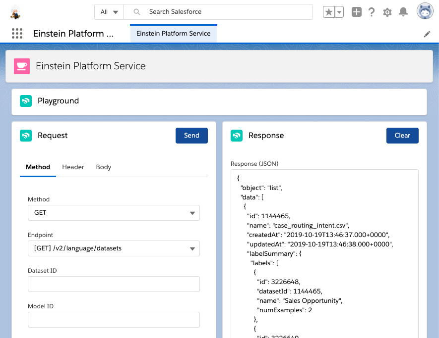

# Einstein Platform Services App



## install my app

```sh
git clone https://github.com/takahitomiyamoto/einstein-platform-services.git
cd einstein-platform-services
sfdx force:org:create -s -a EinsteinPlatformServices -d 7 -f config/project-scratch-def.json
sfdx force:source:push -u EinsteinPlatformServices
sfdx force:user:permset:assign -n Einstein_Platform_Services -u EinsteinPlatformServices
sfdx force:org:open -u EinsteinPlatformServices -p lightning/n/Einstein_Platform_Services
```

## install Einstein Vision and Language Model Builder

- [Einstein Vision and Language Model Builder](https://appexchangejp.salesforce.com/appxListingDetail?listingId=a0N3A00000FR4PKUA1)

In order to install this AppExchange app, open the URL generated by the following command.

```sh
APP_ID=04t0b000001jiGJAAY
INSTANCE_URL=$(sfdx force:org:display -u EinsteinPlatformServices | grep 'Instance Url')
echo "${INSTANCE_URL}/packagingSetupUI/ipLanding.app?apvId=${APP_ID}"
```

## Acknowledgement

- [salesforce-einstein-platform-apex](https://github.com/muenzpraeger/salesforce-einstein-platform-apex)
- [SFDC：Apex で『Content-Type: multipart/form-data』の API を実行](https://tyoshikawa1106.hatenablog.com/entry/2017/07/22/225204)

# Appendix

## get Einstein Access Token

- [Einstein Access Token](https://api.einstein.ai/token)
